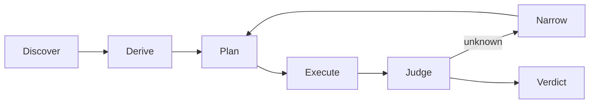

# Architecture Anchor (Conceptual North Star)

**“Anchor”** here means the *ideal architecture skeleton* for this repo — a permanent, name-agnostic description of how the system should behave at a high level. It is **not** the product name and **not** an implementation spec. Treat this as the north star across all iterations.

---

# Immutable Flow

1. **Discover** — Formulate a *falsifiable* claim grounded in specific code regions.
2. **Derive** — Break the claim into a few *objective, testable conditions*.
3. **Plan** — Propose the *minimum* actions needed to decide each condition.
4. **Execute** — Perform actions *read-only* and produce machine-readable observations **with citations**.
5. **Judge** — Decide each condition (`satisfied | failed | unknown`) using the *latest successful* observation.
6. **Narrow** — If unknown, generate targeted subconditions that remove the uncertainty; loop back.
7. **Verdict** — Aggregate condition states into a final finding with rationale and traceable evidence.

This loop is permanent; tooling beneath it may change.

---

# Non-Negotiable Invariants

* **Evidence over speculation**: Every non-error observation includes citations to concrete code/artifacts.
* **Determinism**: Same inputs → same outputs. Any randomness is bounded/removed.
* **Isolation by contract**: Stages exchange small, strict, machine-readable blobs. No hidden state.
* **Read-only**: No writes to the target repo; no external network effects.
* **Low false-positive bias**: Unproven → `UNKNOWN`. A single *failed* condition (with evidence) → `FALSE_POSITIVE`.
* **Reproducibility**: A finding can be re-run and independently checked from stored artifacts alone.

---

# Roles (conceptual, interchangeable)

* **Orchestrator** — Runs the flow, enforces contracts, persists artifacts.
* **Analyst/Agent** — Reads/searches/parses locally; returns observations with citations.
* **Judge** — Applies explicit decision rules to observations.
* **Narrower** — Converts ambiguity into decisive subconditions.
* **Store/Reporter** — Streams events and stores artifacts for traceability.

> Any concrete technology can implement these roles as long as the invariants and flow hold.

---

# Interface Shapes (format *shape*, not schemas)

Keep payloads small and explicit. Suggested minimal shapes:

* **Claim**
  `{ claim: string, citations: [{path, start_line, end_line}] }`

* **Condition**
  `{ desc, accept, reject }`

* **Planned Task**
  `{ task: string }  // a single, clear, repo-local action`

* **Observation**
  `{ summary: string, citations: [{path, start_line, end_line}], notes? }`

* **Judgment**
  `{ state: "satisfied"|"failed"|"unknown", rationale, evidence_refs: [int] }`

* **Verdict**
  `{ state: "TRUE_POSITIVE"|"FALSE_POSITIVE"|"UNKNOWN", reason }`

Implementation may extend these; **do not** weaken them.

---

# Extension Rules

* You may swap analyzers, planners, models, or storage — **without** changing the flow or invariants.
* Prefer *smaller, stricter* interfaces over rich ones. If extra data isn’t required for judgment, don’t add it.
* When in doubt, default to `UNKNOWN` and specify the *single* missing evidence needed.

---

# How to Use This Anchor

* Treat this file as the **north-star contract**.
* If a proposal conflicts with *flow* or *invariants*, change the proposal — not this anchor.
* If a detail isn’t here, it’s intentionally *not* fixed; feel free to iterate beneath the anchor.

*This document is the enduring purpose and architecture skeleton. Everything else is implementation.*

